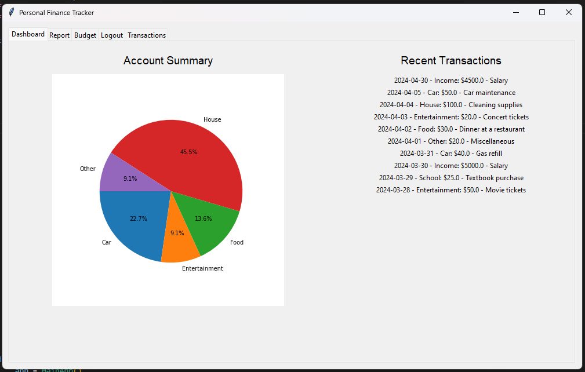
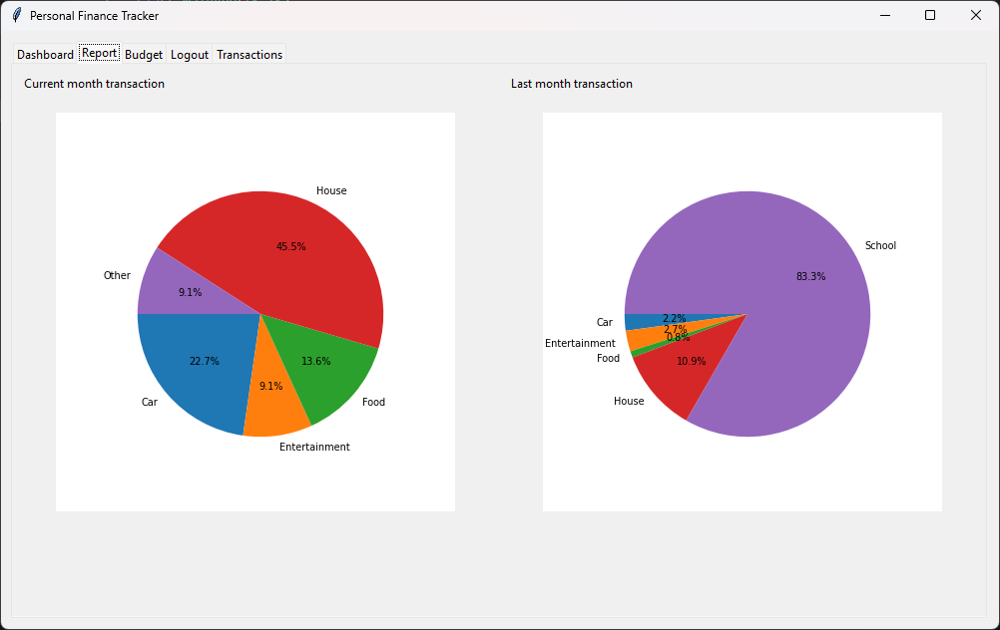
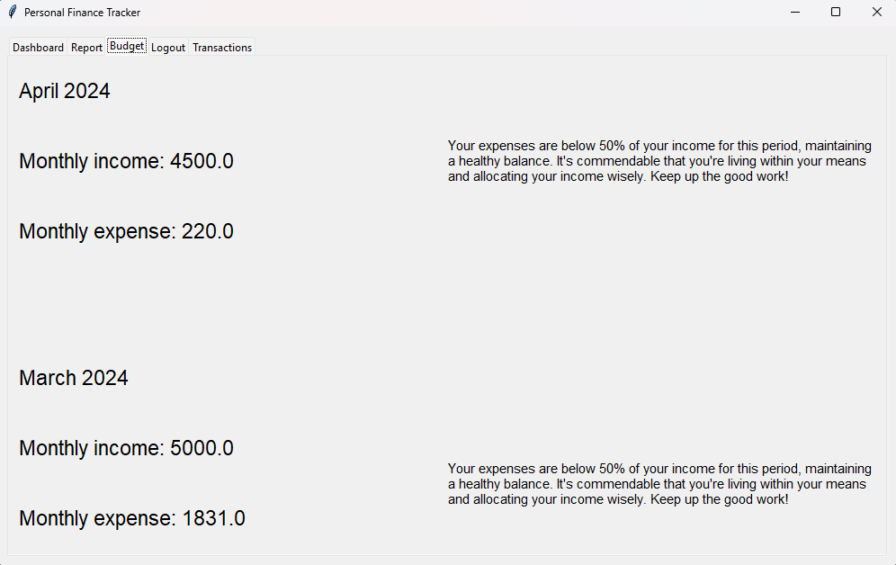
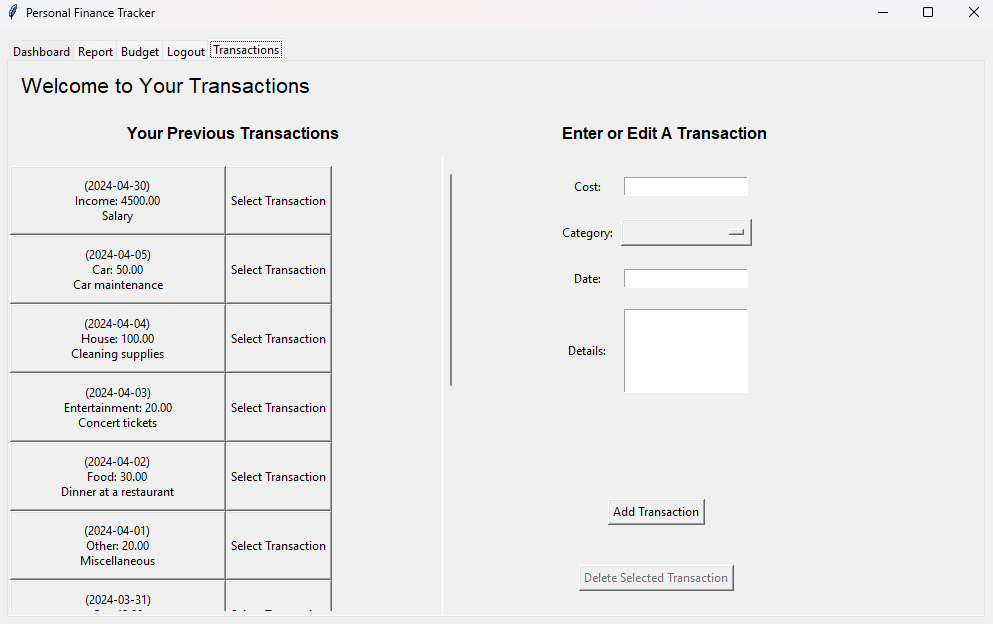

# FinancialTrackPlanner
 FinTrackPlanner is a Tkinter-based Personal Finance Tracker and Budget Planner application designed to help users manage their finances efficiently. Offering features like expense tracking, budget planning, and financial reporting, it aims to provide an intuitive and comprehensive tool for personal financial management. Built with Python and SQLite, this project emphasizes user-friendly design, data security, and insightful financial analytics to promote better financial decisions.
Certainly! Below is a template for a README markdown file tailored for a Python application like the Personal Finance Tracker:


# Personal Finance Tracker

The Personal Finance Tracker is a Python application designed to help individuals manage their finances effectively by tracking income, expenses, and budgeting.






## Features

- **User Authentication**: Secure login system to protect user data.
- **Transaction Management**: Add, edit, and delete income and expense transactions.
- **Budget Tracking**: Monitor budget status with monthly income and expense summaries.
- **Reports and Visualization**: Generate detailed reports and visualize financial data with charts.
- **Customization**: Customize spending categories and budget limits according to individual preferences.

## Installation

1. Clone the repository to your local machine:

   ```bash
   git clone https://github.com/yourusername/personal-finance-tracker.git
   ```

2. Navigate to the project directory:

   ```bash
   cd personal-finance-tracker
   ```

3. Install the required dependencies:

   ```bash
   pip install -r requirements.txt
   ```

## Usage

1. Run the application:

   ```bash
   python database.py
   python main.py
   ```

2. Access the application as it launches.
3. Log in with your username and password to start managing your finances.
4. Log in with the following sample credentials to start managing your finances:
   - Username: `User`
   - Password: `password`

## Configuration

- Update the `config.py` file to configure database settings, secret keys, and other application parameters.

## Contributing

Contributions are welcome! If you find any bugs or have suggestions for improvements, please open an issue or submit a pull request.

## License

This project is licensed under the [MIT License](LICENSE).

## Acknowledgements

- thanks to [@SevenStar0516] and [@adamhadzikadunic] for their valuable contributions to the project.

## Support

For questions or support, please contact [Roy Su] at [roy.su@mail.utoronto.ca].
